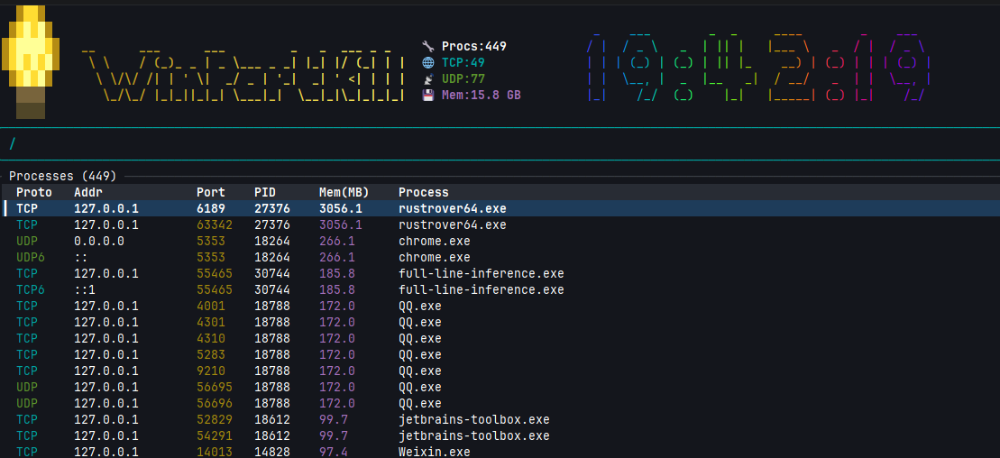

# WinPortKill

Windows 端口进程管理 TUI 工具 — 查看端口占用、搜索过滤、一键 kill 进程。

## 特性

- 黄色灯泡 Logo + ASCII art 标题 + 炫彩 figlet 时钟
- 实时统计：进程数、TCP/UDP 连接数、内存占用
- 按协议/端口/PID/进程名/IP 多字段过滤
- 一键 kill 进程（需管理员权限终止受保护进程）
- 时钟每秒更新，进程列表每 10 秒自动刷新


## 安装

```bash
cargo build --release
```

编译产物在 `target/release/winportkill.exe`。

## 运行

普通运行（仅查看端口，无法 kill 受保护进程）：

```bash
winportkill.exe
```

管理员运行（可 kill 任意进程）：

```bash
# 以管理员身份打开 PowerShell/CMD 后执行
winportkill.exe
```

## 界面

```
┌─ 💡 Logo | WinPortKill ASCII Art | 📊 Stats | 🕐 Clock ──────────────────┐
│ / Filter: [___________]                                                  │
│ Proto  Addr       Port   PID    Mem(MB)  Process                        │
│ TCP   0.0.0.0     80     1234   12.5     nginx.exe                      │
│ TCP   0.0.0.0     443    1234   12.5     nginx.exe                      │
│ TCP   127.0.0.1   3000   5678   45.2     node.exe               ←选中  │
│ UDP   0.0.0.0     5353   999    1.8      svchost.exe                    │
│                                                                          │
│ [q]Quit [k]Kill [/]Filter [r]Refresh [↑↓]Nav [PgUp/PgDn]Jump           │
└──────────────────────────────────────────────────────────────────────────┘
```

顶部信息栏四栏布局：灯泡 Logo → 黄色渐变 ASCII art 标题 → 统计数据 → 炫彩 figlet 时钟。

## 快捷键

| 按键 | 功能 |
|------|------|
| `↑` / `↓` | 上下移动选中行 |
| `PageUp` / `PageDown` | 快速滚动 |
| `/` | 进入过滤模式 |
| `Enter` / `Esc` | 退出过滤模式 |
| `k` | Kill 选中行对应的进程 |
| `r` | 手动刷新端口列表 |
| `q` | 退出程序 |

## 过滤

按 `/` 进入过滤模式后，输入内容会实时过滤列表，支持按以下字段搜索：

- 端口号（如 `8080`）
- PID（如 `1234`）
- 进程名（如 `node`）
- IP 地址（如 `127.0.0.1`）
- 协议（如 `tcp` / `udp`）

## Kill 进程

选中目标行后按 `k`，程序会终止对应 PID 的进程。

- 成功：底部状态栏显示绿色 `Killed PID xxx`
- 失败：显示红色 `Failed to kill PID xxx (need admin?)` — 需要以管理员身份运行
- 进程不存在：显示 `PID xxx not found`

Kill 成功后列表会自动刷新。

## 刷新策略

- **时钟**：每秒更新（1s UI tick）
- **进程列表**：每 10 秒自动刷新数据，也可按 `r` 手动刷新